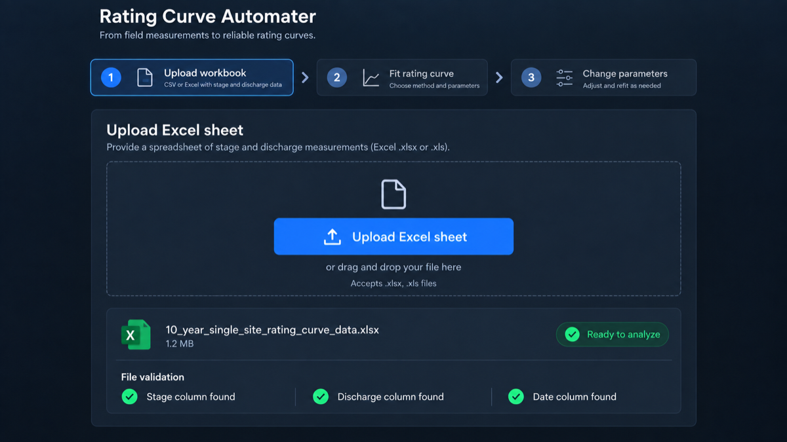

# Rating Curve Automater

[](https://pypi.org/project/rating-curve-automater/)
[](https://pypi.org/project/rating-curve-automater/)
[](https://github.com/ZergFromZ0rg/Rating-Curve-Automater/actions/workflows/test.yml)
[](LICENSE)

**Rating Curve Automater turns field-gauging spreadsheets into reviewable,
uncertainty-aware stage–discharge rating curves.**

It validates messy measurements, fits single or piecewise power-law curves,
reports uncertainty and drift diagnostics, and exports an Excel report.

> Provisional software: review all curves, flags, and extrapolations as a
> qualified hydrographer before operational use.



## Features

- Spreadsheet loading with column, sheet, header, unit, and quality checks.
- OLS, weighted, piecewise, and optional Bayesian fitting.
- Bootstrap confidence/prediction bands and leave-one-out accuracy checks.
- Temporal-drift diagnostics and optional Manning cross-section checks.
- CLI, Streamlit web UI, Python API, rating-table export, and Excel reports.

## Install

Requires Python 3.10+.

```bash
python3 -m venv .venv
source .venv/bin/activate        # Windows: .venv\Scripts\activate
pip install "rating-curve-automater[app]"
rca app
```

For development from a clone:

```bash
git clone https://github.com/ZergFromZ0rg/Rating-Curve-Automater.git
cd Rating-Curve-Automater
pip install -e ".[app,dev]"
```

Optional Bayesian fitting:

```bash
pip install "rating-curve-automater[bayesian]"
```

## Usage

### Web UI

```bash
rca app
```

Upload an `.xlsx`, `.xls`, or `.csv` gauging file, review the detected fields,
fit the curve, inspect diagnostics, and download the report.

### CLI

```bash
# Validate a workbook
rca validate measurements.xlsx --output-csv cleaned.csv

# Fit a curve
rca fit --csv cleaned.csv --segments auto --loo

# Write an Excel report and rating table
rca report --csv cleaned.csv --output rating_curve_report.xlsx \
  --rating-table-csv rating_table.csv
```

Run `rca <command> --help` for all options.

### Python API

```python
from rating_curve_automater import RatingCurveWorkflow

workflow = RatingCurveWorkflow()
workflow.load_and_validate("measurements.xlsx")
workflow.run_fit(segments="auto")
workflow.export_report("rating_curve_report.xlsx")
```

## Input and outputs

Required fields are date, stage, and discharge. Optional fields include site,
quality, field notes, and discharge uncertainty. The loader handles common
spreadsheet variations, units, missing values, multiple sites, and wide station
layouts.

The report contains cleaned measurements, fit parameters, uncertainty bands,
flags, diagnostics, charts, and an optional stage-to-discharge rating table.

## Development

```bash
python -m pytest -q
python -m compileall -q rating_curve_automater
python -m build --no-isolation
```

The CI workflow tests Python 3.10–3.13, checks lint, and builds the package on
pull requests and pushes to `main`.

## Repository guides

- [Contributing](CONTRIBUTING.md)
- [Security policy](SECURITY.md)
- [Publishing releases](PUBLISHING.md)
- [Changelog](CHANGELOG.md)
- [GitHub releases](https://github.com/ZergFromZ0rg/Rating-Curve-Automater/releases)

## License

BSD 3-Clause. See [LICENSE](LICENSE).
